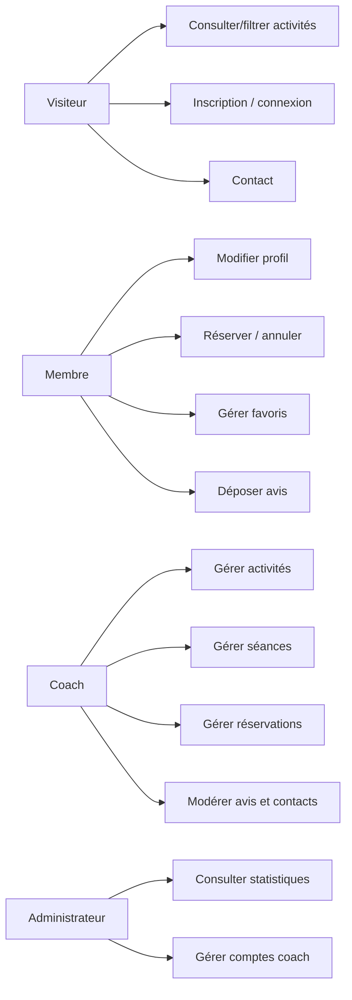
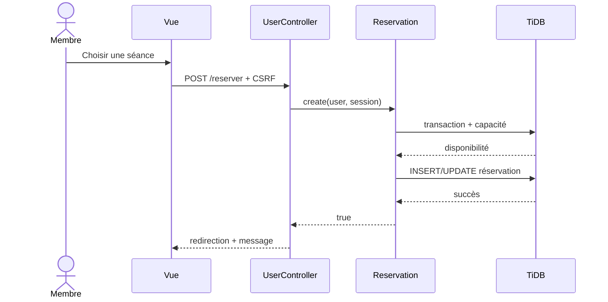
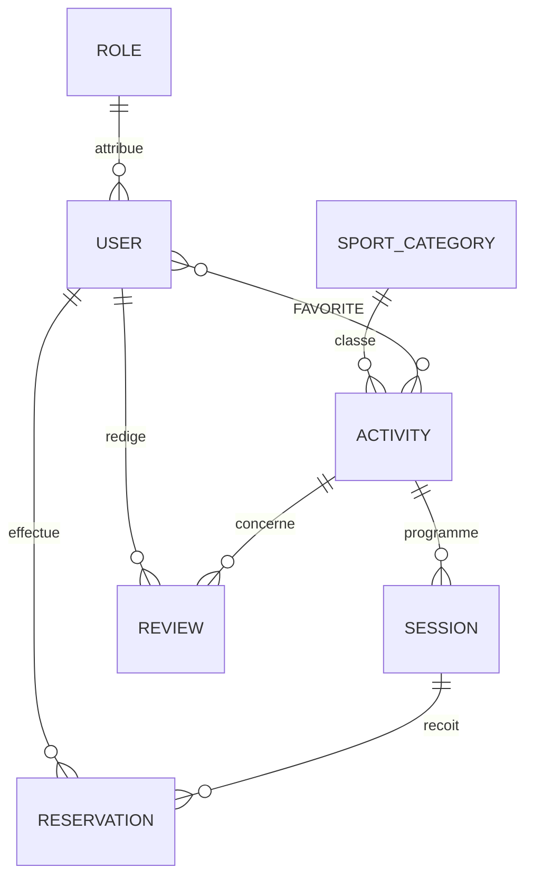

# Diagrammes PENDAFITNESS
## Cas d'utilisation

```mermaid
flowchart LR
V[Visiteur] --> A[Consulter/filtrer activités]
V --> I[Inscription / connexion]
V --> C[Contact]
M[Membre] --> P[Modifier profil]
M --> R[Réserver / annuler]
M --> F[Gérer favoris]
M --> AV[Déposer avis]
CO[Coach] --> GA[Gérer activités]
CO --> GS[Gérer séances]
CO --> GR[Gérer réservations]
CO --> GM[Modérer avis et contacts]
AD[Administrateur] --> ST[Consulter statistiques]
AD --> GE[Gérer comptes coach]
```

## Séquence - réservation

```mermaid
sequenceDiagram
actor M as Membre
participant V as Vue
participant C as UserController
participant RM as Reservation
participant DB as TiDB
M->>V: Choisir une séance
V->>C: POST /reserver + CSRF
C->>RM: create(user, session)
RM->>DB: transaction + capacité
DB-->>RM: disponibilité
RM->>DB: INSERT/UPDATE réservation
DB-->>RM: succès
RM-->>C: true
C-->>V: redirection + message
```

## MCD simplifié

```mermaid
erDiagram
ROLE ||--o{ USER : attribue
SPORT_CATEGORY ||--o{ ACTIVITY : classe
ACTIVITY ||--o{ SESSION : programme
USER ||--o{ RESERVATION : effectue
SESSION ||--o{ RESERVATION : recoit
USER ||--o{ REVIEW : redige
ACTIVITY ||--o{ REVIEW : concerne
USER }o--o{ ACTIVITY : FAVORITE
```
